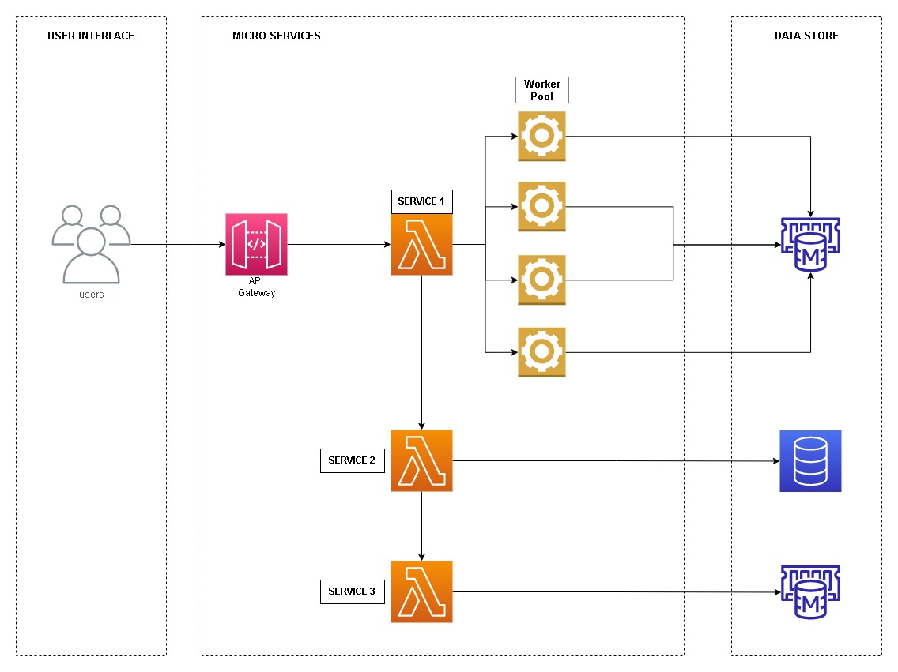

# Feature 01
Listagem de dados bancários para contatos telefônicos

## Diagrama

### Service 1

* Recebe uma lista de contatos
* Separa em blocos 
* Iniciar um Worker Pool
* Atribui os blocos para cada worker disponível
* Aguarda a resposta dos workers e devolve o retorno

#### Worker
* Verifica o contato no memcached, utilizando como chave o ddd+number
* Caso exista, separa o contato com os dados bancários 
* Envia bloco que não existe no memcached para **service 2**

### Service 2

* Recebe bloco de contatos
* Consulta os dados do contato
* Caso não exista, remove do bloco
* Antes de finalizar, chama o **service 3**

### Service 3

* Salva o bloco de contatos no memcached
  * Deve utilizar ddd+number como chave  

### Observações

* Criar serviço para invalidar o memcached
* O service 3 pode ser chamado pelo serviço de login, não vai afetar sua performance
e vai manter as informações atualizadas.
